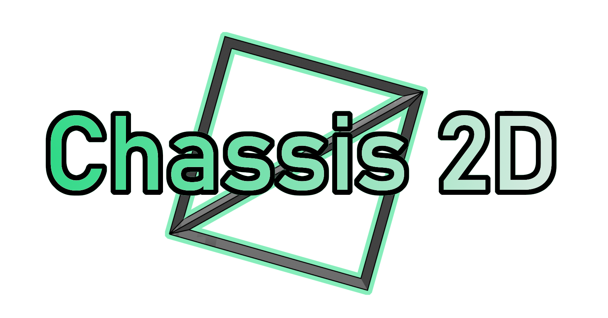

# Disclaimer

**This version is still largely incomplete**

# Chassis2D

Chassis2D is a game framework that aims to make the use of libraries, like SDL2, Box2D, SoLoud, easy by wrapping around them. I am including, in this framework, my many hours of troubleshooting in an attempt to allow more beginners to avoid wasting their time troubleshooting! Overall, though, I am trying to lower the gateway of entry and allow more people to have a quick route to bringing their ideas to life.

# Build Steps

To build the source code

    $ mkdir build
    $ cd build
    $ cmake ..

Compiler will vary between operating systems

# License

Chassis2D is released under the [MIT License](https://opensource.org/licenses/MIT)

